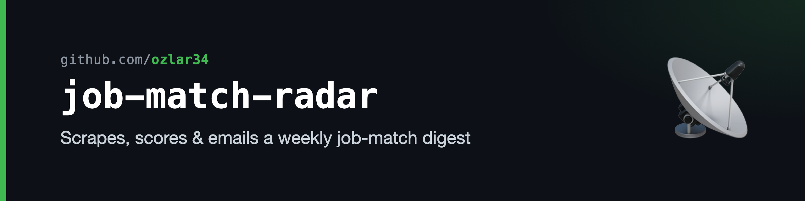
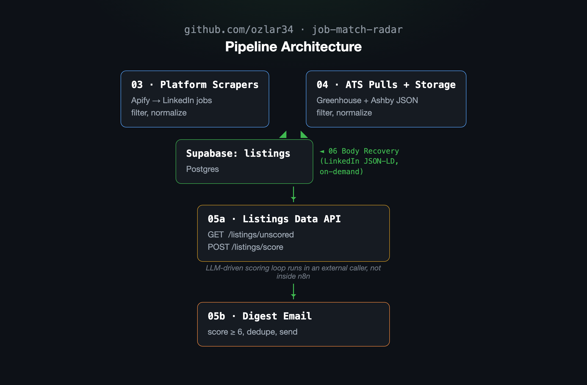
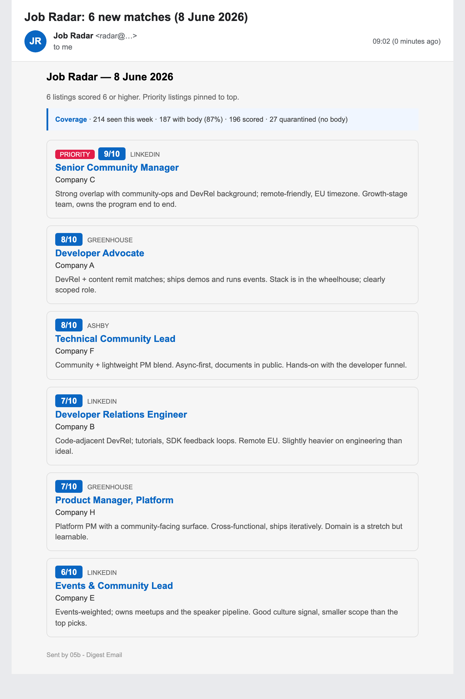

# Job Match Radar

A self-hosted n8n + Supabase pipeline that scrapes LinkedIn and a watchlist of company ATS endpoints, recovers missing job descriptions, scores listings against a personal rubric, dedupes, and emails a weekly digest.

This is the system I built for my own job search. The repo is the actual workflows, exported as n8n JSON, with credentials and webhook IDs blanked. The company watchlist (`Company A`–`I`) and the filter keywords are placeholders — swap in your own. Treat the whole thing as a worked example, not a template; the value is in the shape of the pipeline, not the rubric.

## Architecture



<details>
<summary>Text version</summary>

```
┌─────────────────────────┐      ┌──────────────────────────┐
│ 03 Platform Scrapers    │      │ 04 ATS Pulls + Storage   │
│ Apify → LinkedIn jobs   │      │ Greenhouse + Ashby JSON  │
│ filter, normalize       │      │ filter, normalize        │
└──────────┬──────────────┘      └──────────┬───────────────┘
           │                                │
           └─────────────┬──────────────────┘
                         ▼
              ┌──────────────────────┐
              │  Supabase: listings  │   ◄── 06 Body Recovery
              │  (Postgres)          │       (LinkedIn JSON-LD,
              └──────────┬───────────┘        on-demand)
                         │
                         ▼
            ┌────────────────────────────┐
            │ 05a Listings Data API      │
            │ GET  /listings/unscored    │
            │ POST /listings/score       │
            └────────────┬───────────────┘
                         │  (LLM-driven scoring loop
                         │   runs in an external caller,
                         │   not inside n8n)
                         ▼
            ┌────────────────────────────┐
            │ 05b Digest Email           │
            │ score >= 6, dedupe, send   │
            └────────────────────────────┘
```

</details>

**Why scoring lives outside n8n:** scoring originally ran inside n8n via an LLM node, but a billing surprise plus an SQL bug broke the digest. Splitting scoring out — n8n becomes a thin data API (05a), the LLM lives in the caller — is much easier to debug, rate-limit, and rewrite when the rubric changes.

## The weekly digest

What lands in the inbox: listings scored 6+, priority watchlist pinned to the top, each with a score, source, and a one-line rationale, plus a coverage banner for the scoring window. (Rendered from the real `05b` template with placeholder `Company A`–`I` data.)



## What's in here

| Workflow | Purpose |
|---|---|
| **03 Platform Scrapers** | Apify LinkedIn-jobs actor → filter (role family, language, geography) → normalize → insert into `listings`. |
| **04 ATS Pulls + Storage** | Public Greenhouse + Ashby JSON endpoints for a Notion-driven watchlist — the company list is read dynamically from a Notion database each run, not hardcoded → filter → normalize → upsert into `listings`. Defines the schema. |
| **06 Body Recovery** | Quarantines listings that came back with empty descriptions; re-fetches LinkedIn pages and extracts the `JobPosting` JSON-LD block. Manual-trigger only — run small batches by hand. |
| **05a Listings Data API** | Two thin webhook endpoints over `listings`: `GET /listings/unscored`, `POST /listings/score`. |
| **05b Digest Email** | Selects already-scored listings (score ≥ 6, not yet digested), dedupes across sources, builds an HTML email, sends via Gmail, marks digested. |

Each subdirectory in `workflows/` has its own README with the node inventory, schema, and operational notes.

## Quick start

You need:

- A self-hosted n8n instance (Docker is fine — the included `docker-compose.yml` is what I run locally).
- A Postgres database. I use Supabase free tier; any Postgres works.
- An Apify account (free tier covers ~$5/mo of usage).
- A Gmail account (or any SMTP provider — swap the Gmail node for an Email Send node).

Then:

1. **Bring up n8n:**

   ```bash
   docker compose up -d
   open http://localhost:5678
   ```

2. **Create the database schema.** Run `workflows/04-ats-pulls-storage/schema.sql` against your Postgres instance, then `workflows/05b-digest-email/schema-additions.sql`.

3. **Create credentials in n8n** (the exported JSON has IDs blanked):

   - `Supabase - job-match-radar` (Postgres) — host, port, database, user, password, SSL Require
   - `Apify account` (Apify API token)
   - `Gmail` (gmailOAuth2 — see workflow 05b's README for self-hosted OAuth setup)

4. **Import workflows.** In n8n: Menu → Import from File → select each JSON in `workflows/*/`. Re-bind credentials on each node after import (the credential IDs in the JSON are blanked).

5. **Replace placeholders.** In `05b-digest-email/digest-email.json`, replace the `sendTo` value `your-email@example.com` with your own address.

6. **Activate the workflows you want.** All workflows are exported with manual / webhook triggers only — no Schedule Trigger — because my n8n runs on a laptop and cron was unreliable. If your n8n is always-on (VPS, server), add Schedule Triggers as needed.

## Trigger model

All workflows expose a Webhook Trigger plus a Manual Trigger (the latter for UI testing).

| Workflow | Webhook |
|---|---|
| 03 Platform Scrapers | `POST /webhook/job-scrapers-run` |
| 04 ATS Pulls | `POST /webhook/job-ats-run` |
| 05a Listings Data API | `GET /webhook/listings/unscored`, `POST /webhook/listings/score` |
| 05b Digest Email | `POST /webhook/job-digest-run` |
| 06 Body Recovery | Manual only — no webhook |

The orchestration on top — fire scrape, fire ATS, run scoring loop against 05a, fire digest — lives outside this repo. Any caller can do it (curl, a cron script, or an LLM coding tool).

## Editing the rubric

The filters that decide what's interesting live in two places:

- **Workflow 03 → `Code: Normalize LinkedIn`** — keyword OR-list (LinkedIn search query), exclude-list, priority bonus.
- **Workflow 04 → each `Code: Normalize <Provider>` node** — same exclude-list, plus geography whitelist and Americas-only exclusion.

Scoring itself (the rubric that turns a listing into a 1–10 score and a rationale) lives in the external caller, not in n8n. The 05a workflow doesn't care how scores are produced; it just stores them.

## Evals, guardrail & drift

The rubric is an LLM judge, and LLM judges drift and mis-fire — this one once rated a job 10/10 that explicitly required fluent German. [`evals/`](evals/) is the harness that keeps it honest, seeded entirely from the real human-review log of the judge being wrong and corrected:

- **Gate eval** — 11 documented mis-scores become regression cases; each checks that a hard cap (non-English fluency, sub-floor comp, non-Berlin/no-remote, seniority) actually fires.
- **Guardrail (HITL)** — routes the judge's self-contradicting or borderline outputs to a human-review queue, mirroring the review ritual the cases came from.
- **Drift log** — append-only, keyed to the rubric version (sync tag + prompt sha); flags a `PASS→FAIL` regression if a prompt edit silently breaks a gate.

The shipped drift log records both halves of the story against the current rubric: **replay (before) `0/11` gates fired → live judge (after) `11/11` fired, 0 regressions.** Run it offline with no API key:

```bash
python3 evals/eval.py --judge replay   # the documented "before" table
python3 evals/eval.py --drift           # before→after trajectory + regression alerts
```

See [`evals/README.md`](evals/README.md) for the live-judge path and the full case list. This harness is also published as a standalone repo: [`ozlar34/llm-judge-evals`](https://github.com/ozlar34/llm-judge-evals).

## Tradeoffs / why it's shaped this way

- **Manual triggers, not cron.** My n8n runs on a laptop; cron missed fires every time the machine was off. A weekly task-manager reminder + a one-line script that hits the webhooks ended up more reliable than chasing missed-cron incidents.
- **Postgres dedup + upsert, not application dedup.** The unique index `(source, COALESCE(external_id, url))` is the conflict target for `INSERT ... ON CONFLICT DO UPDATE`. Re-running the scrape doesn't duplicate or no-op — it self-heals: existing rows get their title, company, description, salary, and `date_seen` refreshed from the latest pull.
- **Two workflows for digest, not one.** 05a is a stable data API; 05b is the email side. Splitting them lets the scoring caller iterate independently — the n8n contract is small and stable.
- **Body recovery is on-demand, not automatic.** Concurrent HTTP fetches against LinkedIn collapse to stub responses (verified empirically — 89 fetches in 1.4s recovers 7/89). The recovery workflow is intentionally manual + small-batch. See `workflows/06-body-recovery/README.md`.

## License

MIT. See `LICENSE`.
